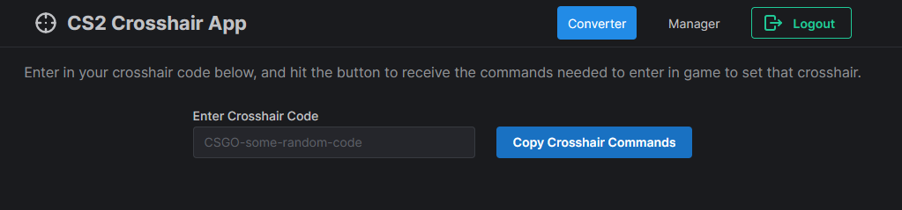
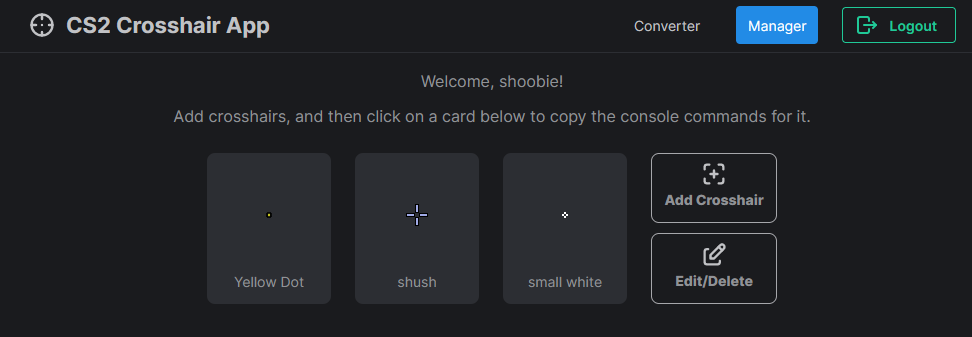

# CS Crosshair Site

[](https://github.com/saddiqs1/cs-crosshairs/actions/workflows/main-deploy.yml)

Back in the good old days of CS:GO, we had the `apply_crosshair_code CSGO-...` command to allow us to quickly switch crosshairs. With the launch of CS2, this was removed, with no mention as to whether it would be returned or not. So in the meantime, you can use this site to enter in a crosshair code and copy all the crosshair commands to your clipboard to allow you to be able to switch crosshair using the in game console.


You can also store crosshairs on the site, to allow you to be able to switch quickly between preferred crosshairs on the fly mid game.


## Tech Stack

-   [NextJs](https://nextjs.org/) with [Typescript](https://www.typescriptlang.org/)
-   [SWR](https://swr.vercel.app/)
-   [Iron Session](https://github.com/vvo/iron-session)
-   [node-steam-openid](https://github.com/LeeviHalme/node-steam-openid)
-   [Mantine Component Library (v6)](https://v6.mantine.dev/pages/getting-started/)
-   [Kysely](https://kysely.dev/) with [kysely-codegen](https://github.com/RobinBlomberg/kysely-codegen)
-   [Postgres](https://www.postgresql.org/)

## Prerequisites

You will need to install the following in order to build, run and develop this repo locally:

-   [git](https://git-scm.com/book/en/v2/Getting-Started-Installing-Git)
-   [Node & `npm`](https://nodejs.org/en/download)
    -   Alternatively you can download both of these via [`nvm`](https://github.com/nvm-sh/nvm#installing-and-updating)
-   [Postgres](https://www.postgresql.org/download/)

## Getting Started

1. Create a file at the root level called `.env.local`, following the `.env example` file. Fill in the relevant gaps.

2. Install all packages.

    ```bash
    npm i
    ```

3. Run the `migrate` command to initialise your database, and optionally run the `db:seed` command to seed your database with example data to start off with.

    ```bash
    npm run migrate
    npm run db:seed
    ```

4. Run the development server and view the page in your browser at [http://localhost:3000](http://localhost:3000).

    ```bash
    npm run dev
    ```

## Database Commands

-   Create a new migration

    ```bash
    npm run migrate:create migration-name
    ```

-   Run all migrations (_NOTE: This will run migrations that have not yet been run_)

    ```bash
    npm run migrate
    ```

-   Generate your database types. You should run this every time after you have run a new migration.

    ```bash
    npm run db:generate
    ```

-   Run migrations from fresh i.e. after deleting everything in the database (_NOTE: This will nuke your database, and run all migrations_)

    ```bash
    npm run migrate:fresh
    ```

-   Run a single migration

    ```bash
    npm run migrate:up
    ```

-   Revert a single migration (_NOTE: This will only revert a single migration at a time. Mainly useful for development_)

    ```bash
    npm run migrate:down
    ```

-   Seed your database (_NOTE: This will insert example data into your database. Mainly useful for development_)

    ```bash
    npm run db:seed
    ```

-   Migrate fresh and seed the db in one command. Useful for the dev environment.

    ```bash
    npm run dev:reset-db
    ```

### TODO

-   [ ] Fix `csgo-sharecode` package import
-   [ ] toggle between 16:9 vs 4:3 for crosshair preview
-   [ ] validation on converter page
